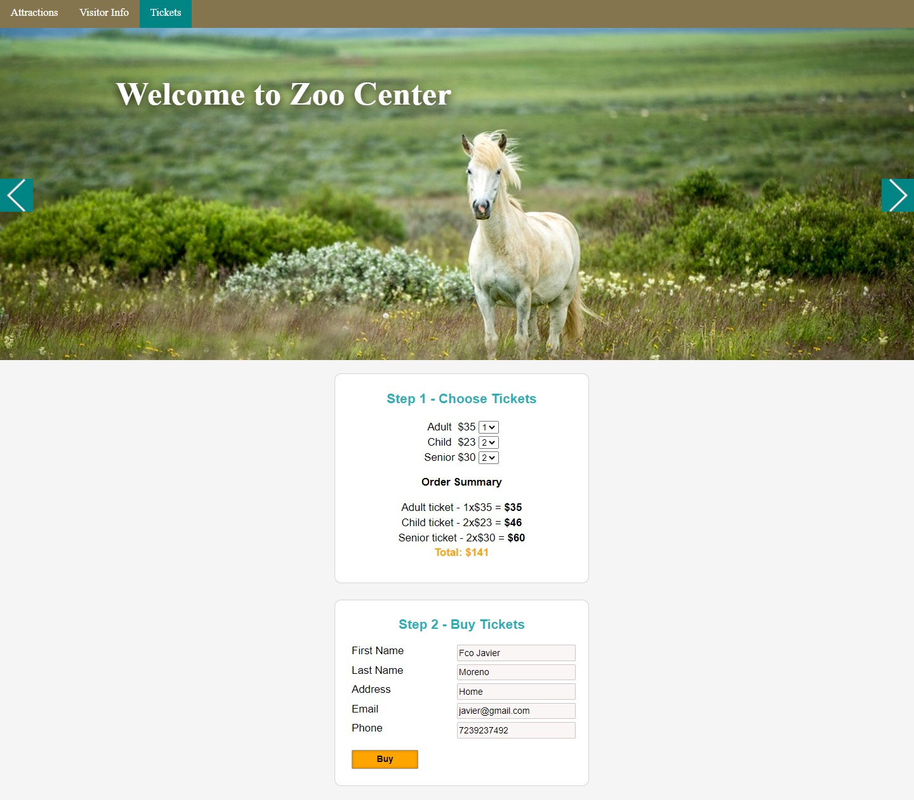

# Module 8: Using Layouts, CSS and JavaScript in ASP.NET Core MVC

## Lab: Using Layouts, CSS and JavaScript in ASP.NET Core MVC

1. **Nombres y apellidos:** Francisco Javier Moreno Quevedo
2. **Fecha:** 02/12/2020
3. **Resumen del Ejercicio:** Añadir los componentes necesarios para hacer funcional la aplicacion de venta de un Zoo 3/4
4. **Dificultad o problemas presentados y como se resolvieron:** Ninguna

- Ejercicio 4: Using jQuery
  - Usamos npm configuration file para añadir referencias a jquery
  
  - modificamos el fichero **package.json** creado y añadimos la referencia al jquery 3.3.1
  
  - Creamos una nueva carpeta que la llamaremos **Middleware**
  
  - Añadimos la clase **ApplicationBuilderExtensions**
  
  - Creamos un metodo que usa los node_modules creados por npm
  
  - En el fichero  **Startup.cs** hacemos referencia a donde estan estos ficheros
  
  - En el **_Layout.cshtml** añadimos el enlace al fichero **jquery.min.js**
  
  - En el fichero de JavaScript  **form-functions.js** amñadimos un evento para cuando cambie el precio
  
  - Usamos jquery para modificar elementos
  
  - Creamos otro fichero JS **menubar-functions.js** donde damos funcionalidad al menu
  
  - Creamos otro fichero JS **slider-functions.js** donde damos funcionalidad a la barra lateral 
  
  - En el Layout **_Layout.cshtml** incluimos los enlaces a estos ficheros js
  
  - En el fichero **package.json** incluimos las dependencias de jquery para la validación del cliente
  
  - En la vista **BuyTickets.cshtml** incluimos los enlaces a estas librerias
  
    

